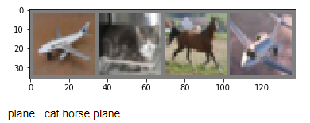
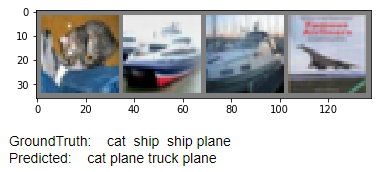

# 训练一个分类器

> 译者：[@小王子](https://github.com/VPrincekin)
> 
> 校对者：[@李子文](https://github.com/liziwenzzzz)

就是这个, 你已经看到了如何定义神经网络, 计算损失并更新网络的权重.

现在你可能会想,

## 数据呢?

一般来说, 当你不得不处理图像, 文本, 音频或者视频数据时, 你可以使用标准的 Python 包将数据加载到一个 numpy 数组中. 然后你可以将这个数组转换成一个 `torch.*Tensor`.

*   对于图像, 会用到的包有 Pillow, OpenCV .
*   对于音频, 会用的包有 scipy 和 librosa.
*   对于文本, 原始 Python 或基于 Cython 的加载, 或者 NLTK 和 Spacy 都是有用的.

特别是对于 `vision`, 我们已经创建了一个叫做 `torchvision`, 其中有对普通数据集如 Imagenet, CIFAR10, MNIST 等和用于图像数据的转换器, 即 `torchvision.datasets` 和 `torch.utils.data.DataLoader`.

这提供了巨大的便利, 避免了编写重复代码.

在本教程中, 我们将使用 CIFAR10 数据集. 它有: ‘airplane’, ‘automobile’, ‘bird’, ‘cat’, ‘deer’,‘dog’, ‘frog’, ‘horse’, ‘ship’, ‘truck’ 这些类别. CIFAR10 中的图像大小为 3x32x32 , 即 32x32 像素的 3 通道彩色图像.


cifar10

## 训练一个图像分类器

我们将按顺序执行以下步骤:

1.  加载 CIFAR10 测试和训练数据集并规范化 `torchvision`
2.  定义一个卷积神经网络
3.  定义一个损失函数
4.  在训练数据上训练网络
5.  在测试数据上测试网络

### 1\. 加载并规范化 CIFAR10

使用 `torchvision`, 加载 CIFAR10 非常简单.

```python
import torch
import torchvision
import torchvision.transforms as transforms
use_cuda = torch.cuda.is_available() #用于是否启用gpu
```

torchvision 数据集的输出是范围 [0, 1] 的 PILImage 图像. 我们将它们转换为归一化范围是[-1,1]的张量

```python
transform = transforms.Compose(
    [transforms.ToTensor(),
     transforms.Normalize((0.5, 0.5, 0.5), (0.5, 0.5, 0.5))])

trainset = torchvision.datasets.CIFAR10(root='./data', train=True,
                                        download=True, transform=transform)
trainloader = torch.utils.data.DataLoader(trainset, batch_size=4,
                                          shuffle=True, num_workers=2)

testset = torchvision.datasets.CIFAR10(root='./data', train=False,
                                       download=True, transform=transform)
testloader = torch.utils.data.DataLoader(testset, batch_size=4,
                                         shuffle=False, num_workers=2)

classes = ('plane', 'car', 'bird', 'cat',
           'deer', 'dog', 'frog', 'horse', 'ship', 'truck')

```

让我们展示一些训练图像, 只是为了好玩 (0.0).

```python
import matplotlib.pyplot as plt
import numpy as np

# 定义函数来显示图像

def imshow(img):
    img = img / 2 + 0.5     # 非标准化
    npimg = img.numpy()
    plt.imshow(np.transpose(npimg, (1, 2, 0)))

# 得到一些随机的训练图像
dataiter = iter(trainloader)
images, labels = dataiter.next()

# 显示图像
imshow(torchvision.utils.make_grid(images))
# 输出类别
print(' '.join('%5s' % classes[labels[j]] for j in range(4)))

```



### 2\. 定义一个卷积神经网络

从神经网络部分复制神经网络, 并修改它以获取 3 通道图像(而不是定义的 1 通道图像).

```python
from torch.autograd import Variable
import torch.nn as nn
import torch.nn.functional as F

class Net(nn.Module):
    def __init__(self):
        super(Net, self).__init__()
        self.conv1 = nn.Conv2d(3, 6, 5)
        self.pool = nn.MaxPool2d(2, 2)
        self.conv2 = nn.Conv2d(6, 16, 5)
        self.fc1 = nn.Linear(16 * 5 * 5, 120)
        self.fc2 = nn.Linear(120, 84)
        self.fc3 = nn.Linear(84, 10)

    def forward(self, x):
        x = self.pool(F.relu(self.conv1(x)))
        x = self.pool(F.relu(self.conv2(x)))
        x = x.view(-1, 16 * 5 * 5)
        x = F.relu(self.fc1(x))
        x = F.relu(self.fc2(x))
        x = self.fc3(x)
        return x

net = Net()
if use_cuda is True:
    net.cuda()
```

### 3\. 定义一个损失函数和优化器

我们使用交叉熵损失函数( CrossEntropyLoss )和随机梯度下降( SGD )优化器.

```py
import torch.optim as optim

criterion = nn.CrossEntropyLoss()
optimizer = optim.SGD(net.parameters(), lr=0.001, momentum=0.9)

```

### 4\. 训练网络

这是事情开始变得有趣的时候. 我们只需循环遍历数据迭代器, 并将输入提供给网络和优化器.

```python
for epoch in range(2):  # 循环遍历数据集多次

    running_loss = 0.0
    for i, data in enumerate(trainloader, 0):
        # 得到输入数据
        inputs, labels = data

        # 包装数据
        inputs, labels = Variable(inputs), Variable(labels)
        if use_cuda is True:
            inputs = inputs.cuda()
            labels = lables.cuda()

        # 梯度清零
        optimizer.zero_grad()

        # forward + backward + optimize
        outputs = net(inputs)
        loss = criterion(outputs, labels)
        loss.backward()
        optimizer.step()

        # 打印信息
        running_loss += loss.data.item()
        if i % 2000 == 1999:    # 每2000个小批量打印一次
            print('[%d, %5d] loss: %.3f' %
                  (epoch + 1, i + 1, running_loss / 2000))
            running_loss = 0.0

print('Finished Training')

```

### 5\. 在测试数据上测试网络

我们在训练数据集上训练了2遍网络, 但是我们需要检查网络是否学到了什么.

我们将通过预测神经网络输出的类标签来检查这个问题, 并根据实际情况进行检查. 如果预测是正确的, 我们将样本添加到正确预测的列表中.

好的, 第一步. 让我们显示测试集中的图像以便熟悉.

```python
dataiter = iter(testloader)
images, labels = dataiter.next()

# 打印图像
imshow(torchvision.utils.make_grid(images))
print('GroundTruth: ', ' '.join('%5s' % classes[labels[j]] for j in range(4)))

```



好的, 现在让我们看看神经网络认为这些例子是什么:

```python
outputs = net(Variable(images))
if use_cuda is True:
    outputs = net(Variable(images.cuda()))
else：
    outputs = net(Variable(images))
```

输出的是10个类别的能量. 一个类别的能量越高, 则可以理解为网络认为越多的图像是该类别的. 那么, 让我们得到最高能量的索引:

```python
_, predicted = torch.max(outputs.data, 1)

print('Predicted: ', ' '.join('%5s' % classes[predicted[j]]
                              for j in range(4)))

```

结果看起来不错.

让我们看看网络如何在整个数据集上执行.

```python
correct = 0
total = 0
for data in testloader:
    images, labels = data
    outputs = net(Variable(images))
    _, predicted = torch.max(outputs.data, 1)
    total += labels.size(0)
    correct += (predicted == labels).sum()

print('Accuracy of the network on the 10000 test images: %d  %%' % (
    100 * correct / total))

```


Accuracy of the network on the 10000 test images: 52  %

训练的准确率远比随机猜测(准确率10%)好, 证明网络确实学到了东西.

嗯, 我们来看看哪些类别表现良好, 哪些类别表现不佳:

```python
class_correct = list(0. for i in range(10))
class_total = list(0. for i in range(10))
for data in testloader:
    images, labels = data
    outputs = net(Variable(images))
    _, predicted = torch.max(outputs.data, 1)
    c = (predicted == labels).squeeze()
    for i in range(4):
        label = labels[i]
        class_correct[label] += c[i]
        class_total[label] += 1

for i in range(10):
    print('Accuracy of %5s : %2d  %%' % (
        classes[i], 100 * class_correct[i] / class_total[i]))

```

好的, 接下来呢?

我们如何在 GPU 上运行这些神经网络?

## 在 GPU 上训练

就像你如何将一个张量传递给GPU一样, 你将神经网络转移到GPU上. 这将递归遍历所有模块, 并将其参数和缓冲区转换为CUDA张量:

```py
net.cuda()

```

请记住, 您必须将输入和目标每一步都发送到GPU:

```py
inputs, labels = Variable(inputs.cuda()), Variable(labels.cuda())

```

如果发现在 GPU 上并没有比 CPU 提速很多, 实际上是因为网络比较小, GPU 没有完全发挥自己的真正实力.

**练习:** 尝试增加网络的宽度(第一个 `nn.Conv2d` 的参数2和第二个 `nn.Conv2d` 的参数1 它们需要是相同的数字), 看看你得到什么样的加速.

**目标达成**:

*   深入了解PyTorch的张量库和神经网络.
*   训练一个小的神经网络来分类图像.

## 在多个GPU上进行训练

如果你希望使用所有 GPU 来看更多的 MASSIVE 加速, 请查看可选 [可选: 数据并行](data_parallel_tutorial.html).

## 我下一步去哪里?

*   [训练神经网络玩电子游戏](../../intermediate/reinforcement_q_learning.html)
*   `在 imagenet 上培训最先进的 ResNet 网络`
*   `利用生成对抗网络训练人脸生成器`
*   `使用 Recurrent LSTM 网络训练单词语言模型`
*   `更多的例子`
*   `更多教程`
*   `在论坛上讨论 PyTorch`
*   `与 Slack 上与其他用户聊天`
