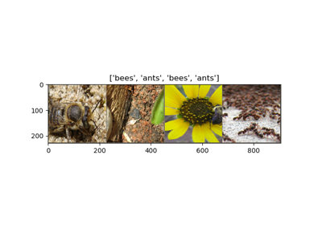
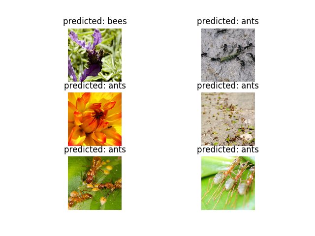

# 迁移学习教程

> 译者：[片刻](https://github.com/jiangzhonglian)

**作者**: [Sasank Chilamkurthy](https://chsasank.github.io)

在本教程中，您将学习如何使用迁移学习来训练您的网络。您可以在 [cs231n 笔记](https://cs231n.github.io/transfer-learning/) 上阅读更多关于迁移学习的信息

引用这些笔记：

> 在实践中，很少有人从头开始训练整个卷积网络（随机初始化），因为拥有足够大小的数据集是相对罕见的。相反，通常在非常大的数据集（例如 ImageNet，其包含具有1000个类别的120万个图像）上预先训练 ConvNet，然后使用 ConvNet 作为感兴趣任务的初始化或固定特征提取器。

如下是两个主要的迁移学习场景：

*   **Finetuning the convnet**: 我们使用预训练网络初始化网络，而不是随机初始化，就像在imagenet 1000数据集上训练的网络一样。其余训练看起来像往常一样。
*   **ConvNet as fixed feature extractor**: 在这里，我们将冻结除最终完全连接层之外的所有网络的权重。最后一个全连接层被替换为具有随机权重的新层，并且仅训练该层。

```py
# License: BSD
# Author: Sasank Chilamkurthy

from __future__ import print_function, division

import torch
import torch.nn as nn
import torch.optim as optim
from torch.optim import lr_scheduler
import numpy as np
import torchvision
from torchvision import datasets, models, transforms
import matplotlib.pyplot as plt
import time
import os
import copy

plt.ion()   # interactive mode

```

## 加载数据

我们将使用 torchvision 和 torch.utils.data 包来加载数据。

我们今天要解决的问题是训练一个模型来对 **蚂蚁** 和 **蜜蜂** 进行分类。我们有大约120个训练图像，每个图像用于 **蚂蚁** 和 **蜜蜂**。每个类有75个验证图像。通常，如果从头开始训练，这是一个非常小的数据集。由于我们正在使用迁移学习，我们应该能够合理地推广。

该数据集是 imagenet 的一个非常小的子集。

注意

从 [此处](https://download.pytorch.org/tutorial/hymenoptera_data.zip) 下载数据并将其解压缩到当前目录。

```py
# Data augmentation and normalization for training
# Just normalization for validation
data_transforms = {
    'train': transforms.Compose([
        transforms.RandomResizedCrop(224),
        transforms.RandomHorizontalFlip(),
        transforms.ToTensor(),
        transforms.Normalize([0.485, 0.456, 0.406], [0.229, 0.224, 0.225])
    ]),
    'val': transforms.Compose([
        transforms.Resize(256),
        transforms.CenterCrop(224),
        transforms.ToTensor(),
        transforms.Normalize([0.485, 0.456, 0.406], [0.229, 0.224, 0.225])
    ]),
}

data_dir = 'data/hymenoptera_data'
image_datasets = {x: datasets.ImageFolder(os.path.join(data_dir, x),
                                          data_transforms[x])
                  for x in ['train', 'val']}
dataloaders = {x: torch.utils.data.DataLoader(image_datasets[x], batch_size=4,
                                             shuffle=True, num_workers=4)
              for x in ['train', 'val']}
dataset_sizes = {x: len(image_datasets[x]) for x in ['train', 'val']}
class_names = image_datasets['train'].classes

device = torch.device("cuda:0" if torch.cuda.is_available() else "cpu")

```

### 可视化一些图像

让我们可视化一些训练图像，以便了解数据增强。

```py
def imshow(inp, title=None):
    """Imshow for Tensor."""
    inp = inp.numpy().transpose((1, 2, 0))
    mean = np.array([0.485, 0.456, 0.406])
    std = np.array([0.229, 0.224, 0.225])
    inp = std * inp + mean
    inp = np.clip(inp, 0, 1)
    plt.imshow(inp)
    if title is not None:
        plt.title(title)
    plt.pause(0.001)  # pause a bit so that plots are updated

# Get a batch of training data
inputs, classes = next(iter(dataloaders['train']))

# Make a grid from batch
out = torchvision.utils.make_grid(inputs)

imshow(out, title=[class_names[x] for x in classes])

```



## 训练模型

现在, 让我们编写一个通用函数来训练模型. 这里, 我们将会举例说明:

*   调度学习率
*   保存最佳的学习模型

下面函数中, `scheduler` 参数是 `torch.optim.lr_scheduler` 中的 LR scheduler 对象.

```py
def train_model(model, criterion, optimizer, scheduler, num_epochs=25):
    since = time.time()

    best_model_wts = copy.deepcopy(model.state_dict())
    best_acc = 0.0

    for epoch in range(num_epochs):
        print('Epoch {}/{}'.format(epoch, num_epochs - 1))
        print('-' * 10)

        # Each epoch has a training and validation phase
        for phase in ['train', 'val']:
            if phase == 'train':
                scheduler.step()
                model.train()  # Set model to training mode
            else:
                model.eval()   # Set model to evaluate mode

            running_loss = 0.0
            running_corrects = 0

            # Iterate over data.
            for inputs, labels in dataloaders[phase]:
                inputs = inputs.to(device)
                labels = labels.to(device)

                # zero the parameter gradients
                optimizer.zero_grad()

                # forward
                # track history if only in train
                with torch.set_grad_enabled(phase == 'train'):
                    outputs = model(inputs)
                    _, preds = torch.max(outputs, 1)
                    loss = criterion(outputs, labels)

                    # backward + optimize only if in training phase
                    if phase == 'train':
                        loss.backward()
                        optimizer.step()

                # statistics
                running_loss += loss.item() * inputs.size(0)
                running_corrects += torch.sum(preds == labels.data)

            epoch_loss = running_loss / dataset_sizes[phase]
            epoch_acc = running_corrects.double() / dataset_sizes[phase]

            print('{} Loss: {:.4f} Acc: {:.4f}'.format(
                phase, epoch_loss, epoch_acc))

            # deep copy the model
            if phase == 'val' and epoch_acc > best_acc:
                best_acc = epoch_acc
                best_model_wts = copy.deepcopy(model.state_dict())

        print()

    time_elapsed = time.time() - since
    print('Training complete in {:.0f}m {:.0f}s'.format(
        time_elapsed // 60, time_elapsed % 60))
    print('Best val Acc: {:4f}'.format(best_acc))

    # load best model weights
    model.load_state_dict(best_model_wts)
    return model

```

## 可视化模型预测

用于显示少量图像预测的通用功能

```py
def visualize_model(model, num_images=6):
    was_training = model.training
    model.eval()
    images_so_far = 0
    fig = plt.figure()

    with torch.no_grad():
        for i, (inputs, labels) in enumerate(dataloaders['val']):
            inputs = inputs.to(device)
            labels = labels.to(device)

            outputs = model(inputs)
            _, preds = torch.max(outputs, 1)

            for j in range(inputs.size()[0]):
                images_so_far += 1
                ax = plt.subplot(num_images//2, 2, images_so_far)
                ax.axis('off')
                ax.set_title('predicted: {}'.format(class_names[preds[j]]))
                imshow(inputs.cpu().data[j])

                if images_so_far == num_images:
                    model.train(mode=was_training)
                    return
        model.train(mode=was_training)

```

## 微调卷积网络

加载预训练模型并重置最终的全连接层。

```py
model_ft = models.resnet18(pretrained=True)
num_ftrs = model_ft.fc.in_features
model_ft.fc = nn.Linear(num_ftrs, 2)

model_ft = model_ft.to(device)

criterion = nn.CrossEntropyLoss()

# Observe that all parameters are being optimized
optimizer_ft = optim.SGD(model_ft.parameters(), lr=0.001, momentum=0.9)

# Decay LR by a factor of 0.1 every 7 epochs
exp_lr_scheduler = lr_scheduler.StepLR(optimizer_ft, step_size=7, gamma=0.1)

```

### 训练和评估

CPU上需要大约15-25分钟。但是在GPU上，它只需不到一分钟。

```py
model_ft = train_model(model_ft, criterion, optimizer_ft, exp_lr_scheduler,
                       num_epochs=25)

```

Out:

```py
Epoch 0/24
----------
train Loss: 0.7565 Acc: 0.6598
val Loss: 0.2146 Acc: 0.9085

Epoch 1/24
----------
train Loss: 0.4915 Acc: 0.7951
val Loss: 0.3471 Acc: 0.8889

Epoch 2/24
----------
train Loss: 0.7898 Acc: 0.7541
val Loss: 0.4754 Acc: 0.8497

Epoch 3/24
----------
train Loss: 0.7151 Acc: 0.7295
val Loss: 0.5705 Acc: 0.8235

Epoch 4/24
----------
train Loss: 0.8363 Acc: 0.7459
val Loss: 0.2653 Acc: 0.9020

Epoch 5/24
----------
train Loss: 0.6235 Acc: 0.7992
val Loss: 0.4678 Acc: 0.8366

Epoch 6/24
----------
train Loss: 1.0205 Acc: 0.7131
val Loss: 0.5871 Acc: 0.8235

Epoch 7/24
----------
train Loss: 0.4644 Acc: 0.8238
val Loss: 0.2850 Acc: 0.8824

Epoch 8/24
----------
train Loss: 0.3654 Acc: 0.8566
val Loss: 0.2785 Acc: 0.9085

Epoch 9/24
----------
train Loss: 0.3400 Acc: 0.8648
val Loss: 0.2869 Acc: 0.9085

Epoch 10/24
----------
train Loss: 0.2939 Acc: 0.8770
val Loss: 0.2930 Acc: 0.8889

Epoch 11/24
----------
train Loss: 0.3057 Acc: 0.8811
val Loss: 0.2768 Acc: 0.9216

Epoch 12/24
----------
train Loss: 0.3081 Acc: 0.8689
val Loss: 0.3098 Acc: 0.8889

Epoch 13/24
----------
train Loss: 0.3764 Acc: 0.8607
val Loss: 0.2620 Acc: 0.9150

Epoch 14/24
----------
train Loss: 0.3119 Acc: 0.8689
val Loss: 0.2642 Acc: 0.9216

Epoch 15/24
----------
train Loss: 0.2269 Acc: 0.9180
val Loss: 0.2648 Acc: 0.9281

Epoch 16/24
----------
train Loss: 0.3055 Acc: 0.8893
val Loss: 0.2605 Acc: 0.9281

Epoch 17/24
----------
train Loss: 0.3213 Acc: 0.8730
val Loss: 0.2535 Acc: 0.9216

Epoch 18/24
----------
train Loss: 0.3325 Acc: 0.8566
val Loss: 0.2747 Acc: 0.9281

Epoch 19/24
----------
train Loss: 0.3007 Acc: 0.8648
val Loss: 0.2759 Acc: 0.9150

Epoch 20/24
----------
train Loss: 0.3498 Acc: 0.8443
val Loss: 0.2742 Acc: 0.9216

Epoch 21/24
----------
train Loss: 0.3433 Acc: 0.8443
val Loss: 0.2605 Acc: 0.8954

Epoch 22/24
----------
train Loss: 0.2822 Acc: 0.8689
val Loss: 0.2610 Acc: 0.9281

Epoch 23/24
----------
train Loss: 0.3025 Acc: 0.8648
val Loss: 0.2766 Acc: 0.9150

Epoch 24/24
----------
train Loss: 0.3401 Acc: 0.8607
val Loss: 0.2650 Acc: 0.9085

Training complete in 1m 13s
Best val Acc: 0.928105

```

```py
visualize_model(model_ft)

```



## ConvNet 作为固定特征提取器

在这里，我们需要冻结除最后一层之外的所有网络。我们需要设置 `requires_grad == False` 冻结参数，以便在 `backward()` 中不计算梯度。

您可以在 [此处](https://pytorch.org/docs/notes/autograd.html#excluding-subgraphs-from-backward) 的文档中阅读更多相关信息。

```py
model_conv = torchvision.models.resnet18(pretrained=True)
for param in model_conv.parameters():
    param.requires_grad = False

# Parameters of newly constructed modules have requires_grad=True by default
num_ftrs = model_conv.fc.in_features
model_conv.fc = nn.Linear(num_ftrs, 2)

model_conv = model_conv.to(device)

criterion = nn.CrossEntropyLoss()

# Observe that only parameters of final layer are being optimized as
# opposed to before.
optimizer_conv = optim.SGD(model_conv.fc.parameters(), lr=0.001, momentum=0.9)

# Decay LR by a factor of 0.1 every 7 epochs
exp_lr_scheduler = lr_scheduler.StepLR(optimizer_conv, step_size=7, gamma=0.1)

```

### 训练和评估

在CPU上，与前一个场景相比，这将花费大约一半的时间。这是预期的，因为不需要为大多数网络计算梯度。但是，前向传递需要计算梯度。

```py
model_conv = train_model(model_conv, criterion, optimizer_conv,
                         exp_lr_scheduler, num_epochs=25)

```

Out:

```py
Epoch 0/24
----------
train Loss: 0.6321 Acc: 0.6270
val Loss: 0.2507 Acc: 0.9085

Epoch 1/24
----------
train Loss: 0.6750 Acc: 0.7131
val Loss: 0.1764 Acc: 0.9412

Epoch 2/24
----------
train Loss: 0.4614 Acc: 0.8033
val Loss: 0.1683 Acc: 0.9477

Epoch 3/24
----------
train Loss: 0.5286 Acc: 0.7705
val Loss: 0.1566 Acc: 0.9542

Epoch 4/24
----------
train Loss: 0.3432 Acc: 0.8566
val Loss: 0.1878 Acc: 0.9281

Epoch 5/24
----------
train Loss: 0.4155 Acc: 0.8402
val Loss: 0.1631 Acc: 0.9412

Epoch 6/24
----------
train Loss: 0.4328 Acc: 0.7951
val Loss: 0.1659 Acc: 0.9542

Epoch 7/24
----------
train Loss: 0.3537 Acc: 0.8566
val Loss: 0.1803 Acc: 0.9412

Epoch 8/24
----------
train Loss: 0.3448 Acc: 0.8279
val Loss: 0.1681 Acc: 0.9412

Epoch 9/24
----------
train Loss: 0.3830 Acc: 0.8402
val Loss: 0.1707 Acc: 0.9412

Epoch 10/24
----------
train Loss: 0.2958 Acc: 0.8689
val Loss: 0.1632 Acc: 0.9542

Epoch 11/24
----------
train Loss: 0.2552 Acc: 0.8893
val Loss: 0.1776 Acc: 0.9346

Epoch 12/24
----------
train Loss: 0.2846 Acc: 0.8689
val Loss: 0.1792 Acc: 0.9346

Epoch 13/24
----------
train Loss: 0.3263 Acc: 0.8566
val Loss: 0.1695 Acc: 0.9412

Epoch 14/24
----------
train Loss: 0.3925 Acc: 0.8361
val Loss: 0.2126 Acc: 0.9216

Epoch 15/24
----------
train Loss: 0.3780 Acc: 0.8074
val Loss: 0.1637 Acc: 0.9477

Epoch 16/24
----------
train Loss: 0.3619 Acc: 0.8525
val Loss: 0.1704 Acc: 0.9412

Epoch 17/24
----------
train Loss: 0.2966 Acc: 0.8689
val Loss: 0.1672 Acc: 0.9346

Epoch 18/24
----------
train Loss: 0.2811 Acc: 0.8934
val Loss: 0.1799 Acc: 0.9412

Epoch 19/24
----------
train Loss: 0.2484 Acc: 0.8893
val Loss: 0.1859 Acc: 0.9281

Epoch 20/24
----------
train Loss: 0.2696 Acc: 0.8975
val Loss: 0.1903 Acc: 0.9412

Epoch 21/24
----------
train Loss: 0.3679 Acc: 0.8197
val Loss: 0.1866 Acc: 0.9412

Epoch 22/24
----------
train Loss: 0.2854 Acc: 0.8852
val Loss: 0.1814 Acc: 0.9346

Epoch 23/24
----------
train Loss: 0.3550 Acc: 0.8443
val Loss: 0.1677 Acc: 0.9412

Epoch 24/24
----------
train Loss: 0.3928 Acc: 0.8033
val Loss: 0.1571 Acc: 0.9477

Training complete in 0m 34s
Best val Acc: 0.954248

```

```py
visualize_model(model_conv)

plt.ioff()
plt.show()

```


**脚本总运行时间:** (1分58.873秒)

[`Download Python source code: transfer_learning_tutorial.py`](../_downloads/07d5af1ef41e43c07f848afaf5a1c3cc/transfer_learning_tutorial.py)[`Download Jupyter notebook: transfer_learning_tutorial.ipynb`](../_downloads/62840b1eece760d5e42593187847261f/transfer_learning_tutorial.ipynb)

[由Sphinx-Gallery生成的图库](https://sphinx-gallery.readthedocs.io)
