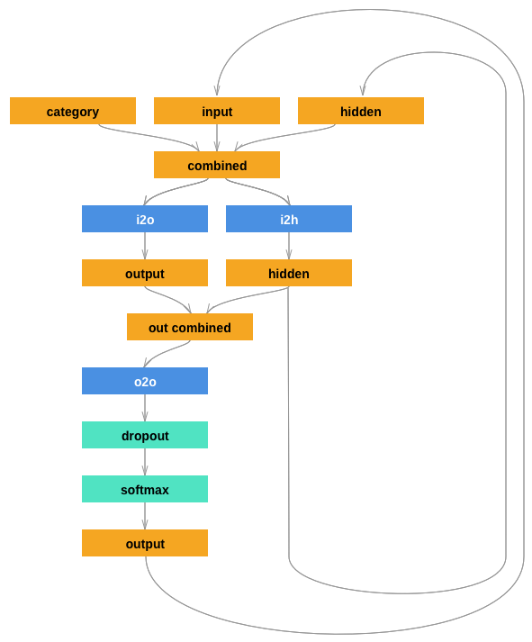

# 基与字符级RNN（Char-RNN）的人名生成

> 译者：[@jianchengss](https://github.com/jianchengss)

**作者**: [Sean Robertson](https://github.com/spro/practical-pytorch)

在 [上一个教程](char_rnn_classification_tutorial.html) 里我们使用RNN把名字分类到它所属的语言中, 这次我们改变一下来学习从语言中生成名字.

```py
> python sample.py Russian RUS
Rovakov
Uantov
Shavakov

> python sample.py German GER
Gerren
Ereng
Rosher

> python sample.py Spanish SPA
Salla
Parer
Allan

> python sample.py Chinese CHI
Chan
Hang
Iun

```

我们仍然手工搭建一个包含几个线性层的小的RNN. 这次的最大的不同是输入一个类别, 每次输出一个字母, 而不是读入所有名字的字母来预测一个类别. 循环的预测每一个字母来构成语言（也可以用文 字或者其他更高级的结构完成）, 通常被称为“语言模型”.

**推荐阅读: **

假设你至少安装了PyTorch, 熟悉Python, 理解Tensors:

*   [http://pytorch.org/](http://pytorch.org/) : 安装说明
*   [PyTorch 深度学习: 60 分钟极速入门教程](../beginner/deep_learning_60min_blitz.html) 获取一般的 PyTorch 入门
*   [跟着例子学习 PyTorch](../beginner/pytorch_with_examples.html) 广泛且深入的概述
*   [PyTorch for former Torch users](../beginner/former_torchies_tutorial.html) 如果曾经是 Lua Torch 的用户

下面这些对了解 RNNs 和其工作原理也是很有用的:

*   [The Unreasonable Effectiveness of Recurrent Neural Networks](http://karpathy.github.io/2015/05/21/rnn-effectiveness/) 展示了一系列真实生活中的例子
*   [Understanding LSTM Networks](http://colah.github.io/posts/2015-08-Understanding-LSTMs/) 是一篇特别关于LSTMs的文章, 但是对于一般的RNNs也很有益的

还建议上一个教程: [用字符级RNN分类名称](char_rnn_classification_tutorial.html)

## 数据准备

注解：

从 [这里](https://download.pytorch.org/tutorial/data.zip) 下载数据, 并解压到当前目录.

更多的细节参考上一个教程, 总之, 数据含有一批纯文本文件: `data/names/[Language].txt` 每一行一个人名. 将行分割成数组, 并把 Unicode 转换成 ASCII 编码, 最后放进一个字典里 `{language: [names ...]}`.

```py
from __future__ import unicode_literals, print_function, division
from io import open
import glob
import unicodedata
import string

all_letters = string.ascii_letters + " .,;'-"
n_letters = len(all_letters) + 1 # 添加 EOS 标记

def findFiles(path): return glob.glob(path)

# 将 Unicode 字符串转换为纯 ASCII 编码, 感谢 http://stackoverflow.com/a/518232/2809427
def unicodeToAscii(s):
    return ''.join(
        c for c in unicodedata.normalize('NFD', s)
        if unicodedata.category(c) != 'Mn'
        and c in all_letters
    )

# 读取文件并分割成行
def readLines(filename):
    lines = open(filename, encoding='utf-8').read().strip().split('\n')
    return [unicodeToAscii(line) for line in lines]

# 构建映射字典 category_lines , 每个类别是由很多个行组成的list
category_lines = {}
all_categories = []
for filename in findFiles('data/names/*.txt'):
    category = filename.split('/')[-1].split('.')[0]
    all_categories.append(category)
    lines = readLines(filename)
    category_lines[category] = lines

n_categories = len(all_categories)

print('# categories:', n_categories, all_categories)
print(unicodeToAscii("O'Néàl"))

```

## 创建网络

> 这个网络扩展了 [上一个教程的RNN](http://pytorch.apachecn.org/cn/tutorials/intermediate/char_rnn_classification_tutorial.html) , 为类别张量添加了一个额外的参数, 并和其他的参数串联在一起. 类别张量

和字母的输入一样是 one-hot 向量.

我们将输出解释成为下一个字母的概率, 采样的时候, 最有可能的输出被当做下一个输入.

为了让网络更加有效工作, 我添加了第二个线性层 `o2o` （在合并了隐藏层和输出层的后面）. 还有一个 Dropout 层, [使输入的部分值以给定的概率值随机的变成 0](https://arxiv.org/abs/1207.0580) （这里概率取0.1）, 这样做通常是为了模糊输入以防止过拟合. 这里我们在网络的最末端使用它, 从而故意添加一些混乱和增加采样的多样化.



```py
import torch
import torch.nn as nn
from torch.autograd import Variable

class RNN(nn.Module):
    def __init__(self, input_size, hidden_size, output_size):
        super(RNN, self).__init__()
        self.hidden_size = hidden_size

        self.i2h = nn.Linear(n_categories + input_size + hidden_size, hidden_size)
        self.i2o = nn.Linear(n_categories + input_size + hidden_size, output_size)
        self.o2o = nn.Linear(hidden_size + output_size, output_size)
        self.dropout = nn.Dropout(0.1)
        self.softmax = nn.LogSoftmax(dim=1)

    def forward(self, category, input, hidden):
        input_combined = torch.cat((category, input, hidden), 1)
        hidden = self.i2h(input_combined)
        output = self.i2o(input_combined)
        output_combined = torch.cat((hidden, output), 1)
        output = self.o2o(output_combined)
        output = self.dropout(output)
        output = self.softmax(output)
        return output, hidden

    def initHidden(self):
        return Variable(torch.zeros(1, self.hidden_size))

```

## 训练

### 训练前的准备

首先, 利用辅助函数产生随机的（category, line）对:

```py
import random

# 从list中随机选取项
def randomChoice(l):
    return l[random.randint(0, len(l) - 1)]

# 获取随机的类别和该类别中随机的行
def randomTrainingPair():
    category = randomChoice(all_categories)
    line = randomChoice(category_lines[category])
    return category, line

```

对每一个时间点（也就是说在训练集中词的每个字母）网络的输入是 `(类别, 当前字母, 隐藏层状态)` , 输出是 `(下一个字母, 下一个隐藏层状态)` . 对于每一个训练集, 我们需要的是类别、输入的字母集、输出/目标字母集.

因为在每一步, 我们从当前的字母预测下一个字母, 这样的字母对是在原有行中连续字母的集合, 例如, 对于 `"ABCD&lt;EOS&gt;"` 将会产生 (“A”, “B”), (“B”, “C”), (“C”, “D”), (“D”, “EOS”).


类别张量是一个大小为 `&lt;1 x n_categories&gt;` 的 [one-hot tensor](https://en.wikipedia.org/wiki/One-hot) 张量, 在训练的每一个时间点把它喂给网络 —— 这是一个设计的选择, 它可以被当作为初始隐藏状或其他策略的一部分.

```py
# 类别的 one-hot 向量
def categoryTensor(category):
    li = all_categories.index(category)
    tensor = torch.zeros(1, n_categories)
    tensor[0][li] = 1
    return tensor

# 输入串从第一个字母到最后一个字母（不包括 EOS ）的 one-hot 矩阵
def inputTensor(line):
    tensor = torch.zeros(len(line), 1, n_letters)
    for li in range(len(line)):
        letter = line[li]
        tensor[li][0][all_letters.find(letter)] = 1
    return tensor

# 目标的第二个字母到结尾（EOS）的 LongTensor
def targetTensor(line):
    letter_indexes = [all_letters.find(line[li]) for li in range(1, len(line))]
    letter_indexes.append(n_letters - 1) # EOS
    return torch.LongTensor(letter_indexes)

```

为了训练过程的便利, 添加一个 `randomTrainingExample` 函数, 获取随机的 (category, line) 对, 并把他们转换成需要的 (category, input, target) 张量.

```py
# 从随机的（category, line）对中生成 category, input, and target 张量
def randomTrainingExample():
    category, line = randomTrainingPair()
    category_tensor = Variable(categoryTensor(category))
    input_line_tensor = Variable(inputTensor(line))
    target_line_tensor = Variable(targetTensor(line))
    return category_tensor, input_line_tensor, target_line_tensor

```

### 网络的训练

与分类相比, 分类只用到了最后的输出, 而这里每个步都会产生一个预测, 所以我们需要计算每一步的损失.

自动求导（autograd）的魔力就在于, 它允许将每一步的损失简单的加和, 并在最后调用 backward

```py
criterion = nn.NLLLoss()

learning_rate = 0.0005

def train(category_tensor, input_line_tensor, target_line_tensor):
    hidden = rnn.initHidden()

    rnn.zero_grad()

    loss = 0

    for i in range(input_line_tensor.size()[0]):
        output, hidden = rnn(category_tensor, input_line_tensor[i], hidden)
        loss += criterion(output, target_line_tensor[i])

    loss.backward()

    for p in rnn.parameters():
        p.data.add_(-learning_rate, p.grad.data)

    return output, loss.data[0] / input_line_tensor.size()[0]

```

为了跟踪训练花费了多长时间, 这里添加一个 `timeSince(timestamp)` 函数, 返回一个人们易读的字符串:

```py
import time
import math

def timeSince(since):
    now = time.time()
    s = now - since
    m = math.floor(s / 60)
    s -= m * 60
    return '%dm %ds' % (m, s)

```

训练和往常一样, 不停的调用 train 并等待一会, 打印当前时间, 每隔 `print_every` 个例子打印 loss, 将每 `plot_every` 个例子的平均损失保存在 `all_losses` 中以便后面画图.

```py
rnn = RNN(n_letters, 128, n_letters)

n_iters = 100000
print_every = 5000
plot_every = 500
all_losses = []
total_loss = 0 # 每 plot_every 次迭代需要重置

start = time.time()

for iter in range(1, n_iters + 1):
    output, loss = train(*randomTrainingExample())
    total_loss += loss

    if iter % print_every == 0:
        print('%s (%d  %d%%) %.4f' % (timeSince(start), iter, iter / n_iters * 100, loss))

    if iter % plot_every == 0:
        all_losses.append(total_loss / plot_every)
        total_loss = 0

```

### 绘制损失

从 all_losses 中绘制历史损失, 以展现网络的学习过程

```py
import matplotlib.pyplot as plt
import matplotlib.ticker as ticker

plt.figure()
plt.plot(all_losses)

```

## 网络采样

为了采样, 我们给网络一个字母并问下一个字母是什么, 重复这个过程直到 EOS 标记.

*   创建输入类别、起始字母和隐藏层状态的张量
*   创建一个带有起始字母的 `output_name` 串
*   直到最大的输出长度,
    *   当前字母喂给网络
    *   从最高的输出获取下一个字母和下一个隐藏层状态
    *   如果输出字母是 EOS, 算法结束
    *   如果输出是常规字母, 将其加入到 `output_name` 并继续
*   返回最终的名字

注解：

与给定起始字母不同的是, 有其他的策略是在训练的时候包含一个“串起始”标记, 让网络选择属于自己的起始字母.

```py
max_length = 20

# 从类别和起始字母采样
def sample(category, start_letter='A'):
    category_tensor = Variable(categoryTensor(category))
    input = Variable(inputTensor(start_letter))
    hidden = rnn.initHidden()

    output_name = start_letter

    for i in range(max_length):
        output, hidden = rnn(category_tensor, input[0], hidden)
        topv, topi = output.data.topk(1)
        topi = topi[0][0]
        if topi == n_letters - 1:
            break
        else:
            letter = all_letters[topi]
            output_name += letter
        input = Variable(inputTensor(letter))

    return output_name

# 给定一个类别和多个起始字母 获取个采样结果
def samples(category, start_letters='ABC'):
    for start_letter in start_letters:
        print(sample(category, start_letter))

samples('Russian', 'RUS')

samples('German', 'GER')

samples('Spanish', 'SPA')

samples('Chinese', 'CHI')

```

## 练习

*   尝试使用不同 类别-&gt;行 数据集, 例如:
    *   小说系列 -&gt; 角色名字
    *   词性 -&gt; 词语
    *   国家 -&gt; 城市
*   使用“串起始”标记, 使采样的时候不用给定起始字母
*   使用更大和/或更好的网络结构获取更好的结果
    *   尝试一下 nn.LSTM 和 nn.GRU 层
    *   将这些 RNNs 组合成更高级的网络
